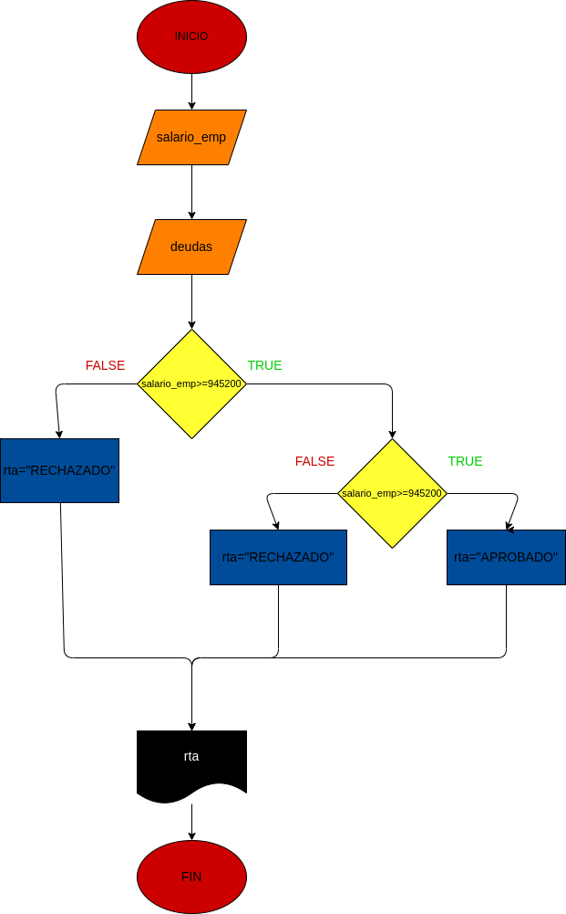

# Ejercicio N.2

## Programa que permita realizar un préstamo bancario, teniendo en cuenta que el préstamo será otorgado solamente a personas con ingresos superiores a $945200 y que no posea ninguna otra deuda.

# ANALISIS.

variables de entrada (input)

salario_emp: salario del empleado

deudas: indica si el empleado tiene o no deudas

# PROCESSING

APROBADO: salario_emp >=945200

rta: indica si el perimetrp es o no otorgado

# DISEÑO

# CONSTRUCCION

