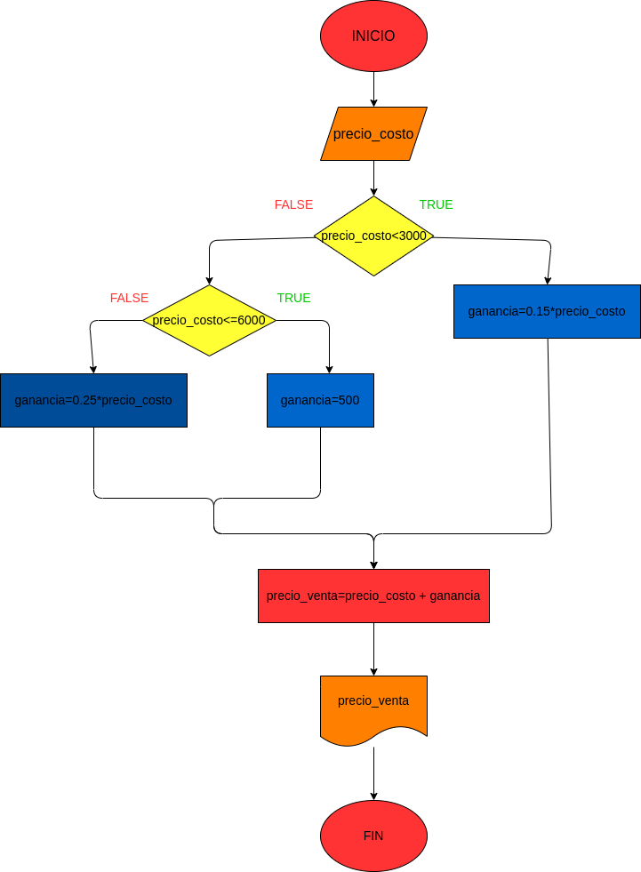

# Ejercicio No.3

## Programa que le indique el precio de venta de un articulo dado.

# ANALISIS

variables de entrada (input)

precio_costo: precio el que se compra el producto

# PROCESSING

ganancia: porcentaje de rentabilidad del producto

# OUTPUT

precio_venta: precio el que se vende el producto

# DISEÑO

# CONSTURCCION