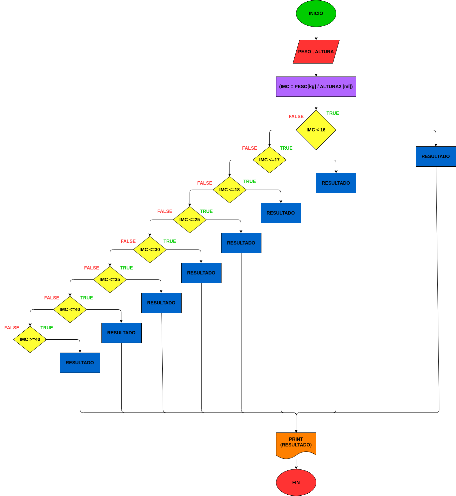

# EJERCICIO No. 4

## Programa que calcule el índice de masa corporal de una persona.

# ANALISIS.

variables de entrada (input)

Peso: el peso del cliente

Altura: La altura de el cliente

# PROCESSING.

(IMC = PESO kg / ALTURA2 ml)

De 16 a 17 = Infrapeso

De 17 a 18 = Bajo peso

De 18 a 25 = Peso normal (saludable)

De 25 a 30 = Sobrepeso (obesidad de grado I)

De 30 a 35 = Sobrepeso crónico (obesidad de grado II)

De 35 a 40 = Obesidad premórbida (obesidad de grado III)

Mayor a 40 = Obesidad mórbida (obesidad de grado IV)

# OUTPUT.

El índice de masa corporal de la persona

El estado de la persona

# DISEÑO.

# CONSTRUCCION.