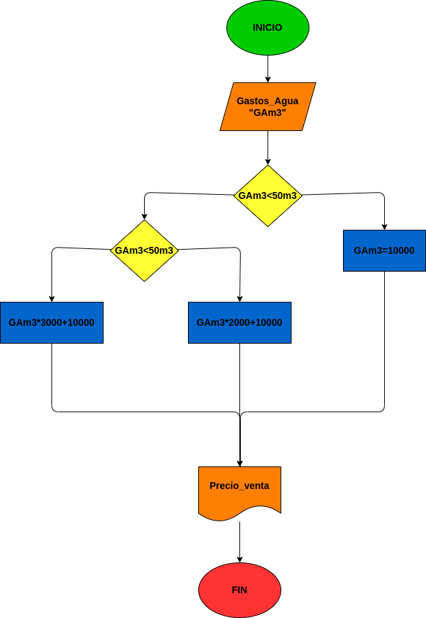

# Ejercicio No.5

## Programa para calcular el costo del agua a pagar

# ANALISIS

--Varibles de Entrada (input)

Gasto_Agua = El gasto del agua de su vivienda

# PROCESSING

--Variables de Proceso

Pago = Es el monto a pagar dependiendo del consumo de agua de la vivienda

# OUTPUT

--Variables de Salida

Pago: Es el monto requerido por la empresa a pagar

# DISEÑO

# CONSTRUCCION
