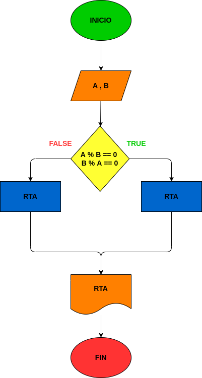

## Ejercicio No.8

## Programa que lea dos números enteros y averigüe si el uno es múltiplo del otro.

# ANALISIS

# iNPUT

--Variables de entrada (input)

A = 1 numero

B = 2 numero

# PROCESSING

--variables de proceso (processing)

A % B = 0 : esto se hace para saber si el resultado es 0 si es haci son multiplos

# OUPUT

--Variables de salida (Oput)

RTA : dice si son multiplos o no

# DISEÑO

# CONSTRUCCION